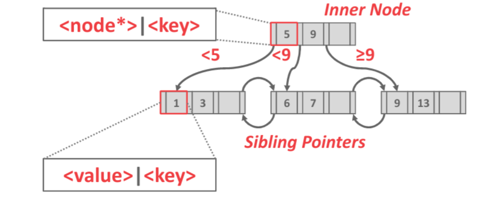
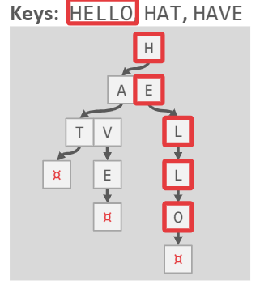

- Hash table
	- 优缺点
		- 单点查询快
		- 不适合范围查询
	- hash 函数
		- 冲突少
		- 快（mod）
	- 实现方法（schema）
		- 静态表：表的大小是固定的
			- 线性探测
				- 当发现冲突时，向下探测
				- 删除时需要墓碑
			- robin hood：保证向下探测的步骤比较平均
				- 每个hash元素保存距离原本slot的距离
				- 当新插入时（距离为0）或者向下探测时
					- 比较自己和当前位置的距离。如果自己比较大，便抢占当前位置，使得它向下探测
			- ckckoo hash：使用两个hash函数减少冲突
				- 假设有两个hash 表 t1, t2
				- 插入一个值key：
					- 若hash的位置为空，则插入
					- 否则置换，得到新的key
					- 重新hash，看新的key 的hash的位置是否为空，若不的话，返回步骤1
				- 何时会造成死循环
		- 动态表
			- 链表：在每个hash slot中，加一个链表
			- extendible hashing：<a  href="https://www.geeksforgeeks.org/extendible-hashing-dynamic-approach-to-dbms/">博客描述</a>，当链表过长时需要分裂
				- hash 的hash 函数分为两种
					- global depth：及全局的的hash bit数
					- local depth：本地bucket使用的hash bit数
				- 当bucket溢出的时候会增加local depth：
					- 具体的，当local depth < global depth的时候，直接分裂，并重新映射directory
					- 当local depth = global depth，会先增加global depth，然后转步骤1
			- Linear Hashing：每次只增加一个页
				- 核心：每次发生overflow的时候，会分裂当前cursor所在的页，并将其往下移动
				- 这样可以不用移动当前cursor以下的数据
- B+ tree
	- 结构 
		- inter node：k个value，k+1 个子节点
		- leaf node：k个key-value对（合并在一起为了更好的局部性） 
	- 操作
		- 插入：分裂
			- 找到合适的leaf node：L
			- 插入到L中
				- 如果L满了，需要分裂为两个leaf
				- 并插入新的middle key到父节点中去·
		- 删除：合并
			- 找到合适的leaf node：L
			- 删除
				- 如果L小于阈值，则需要做一些操作
				- 向兄弟节点借
				- 如果失败，合并兄弟节点，并递归删除父节点的对应项
	- 重复的key
		- append record id 
		- overflow leafnode 
	- 变长的key
		- padding
		- indirect latyer
			- 在indirect layer中还可以加上原key的部分信息，使得搜索的更快
	- Intra-Node Search
		- linear：插入快O(1)，搜索慢O(n)
		- binary：插入慢O(lgn)，搜索快O(lgn)
		- interporlation
	- optimization
		- prefix compression：相同的前缀只保存一次，是否对于插入不友好？
		- Deduplication：在空间保存上不保存多个重复的key
		- Suffix Truncation：inner node中key只是一个起到一个区分的作用，所以可以截断那些无用的后缀
		- Bulk Insert：不再自顶向下插入，而是自下而上的构建
		- Pointer Swizzling：如果保存page id，那么每次从buffer pool fetch page，会使得buffer pool 加锁，开销比较大。所以可以直接保存地址（需要追踪是否失效（被置换了））
- clustered index
	- 使得tuple在物理上以clustered index的顺序保存
	- 一般是primary key
- Additional Index Usage
	- Implicit Indexes：DBMS 会为每个primary key和unique key创建一个index，使得避免重复
	- Partial Indexes：只在部分tuple上建立索引，使得索引更小 
	- Covering Indexes：如果被query的属性在key中，那么就不需要去取tuple 
	- Index Include Columns：可以在key中嵌入其它的column，只是额外的信息，不做比较参考 
	- Function/Expression Indexes：允许对column做一些变换构建索引 
- 其它树的变种
	- trie 树:<a  href="https://leetcode-cn.com/problems/implement-trie-prefix-tree/">leetcode trie树</a>
		- 保存前缀，为了查找某个单词是否存在
		- 结构 
			- 每个节点有n个span，代表其节点保存字符的种类
			- 每条路径代表一个word
		- 性质
			- 每个word的查找时间，只取决于这个word的长度
	- radix 树
		- 只有一个child的节点，会和其父节合并
		- 更省空间
		- 可能导致错误的结果（具有相同前缀，但实际并不存在的word）
- Inverted Indexes
	- 反向索引
		- 正常索引：索引 -> 文章
		- 反向索引：文章部分->文章索引
	- 用于关键词查询
- 并发
	- 锁  ​<a  href="https://mubu.com/doc33roY4duwOX">Concurrency</a>​
	- 并发数据结构
		- hash 表
			- page latch：锁的操作开销大，并发程度高
			- slot latch：锁的操作开销小，并发程度高
		- B+树
			- Basic Latch Crabbing Protoco
				- 从上到小遍历
				- 每次获取当前page的锁
				- 获取 child 的 latch
				- 如果child安全，那么释放parent
					- search：一定是safe的
					- insert：child 未满
					- delete：节点超过半满
			- Better Latch Crabbing
				- root会成为瓶颈，因为所有的人都要获取其latch
				- 乐观的想法：
					- 假设每次写或者删除都只影响leaf
					- 所以每次一路只申请读锁
					- 如果发现要split或者merge，那么重试读锁
				- 进一步
					- 每次申请读锁，必要时转变为读锁
			- Leaf Node Scans
				- leaf 可能会出现死锁
					- 一个进程 从左向右持有释放锁
					- 一个进程 从右向左持有释放锁
				- 自杀：当一个进程尝试加锁失败时，会自杀重试
			- Delay Parent Updates
				- 如果要split时，会标记下，不更新parent
				- 等下个任务遍历到parent后，再进行更新