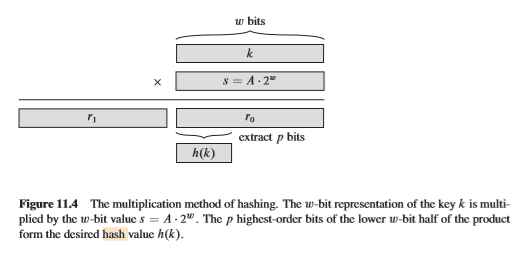
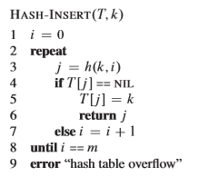
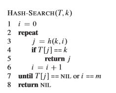
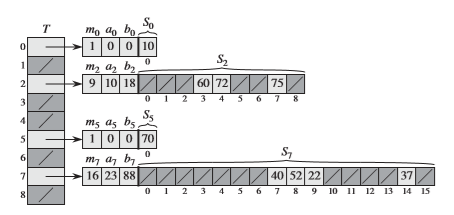

- 直接寻址表
	- 全域关键字集合U比较小，能够完全覆盖
- 散列表
	- 全域关键字集合U较大，而实际关键字集合K相对比较小：使用直接寻址需要申请很大空间，较为浪费
	- hash函数：通过函数使得全域**U**映射散列表中**T**
		- H(U) = T,其中T的大小远小于U
- 散列函数，其中散列表大小为m
	- 目标：尽量保证每个关键字都被均匀的散列表的任何位置
	- 除法散列法
		- h( x ) = x % m
		- m取值注意
			- m最好不要是2的幂，如果这样，h( x )由x的低位（2进制）决定，在无法保证 **集合K** 低位是否是均匀的情况下，我们最好考虑关键字的所有位
			- m最好不是**2^p - 1：**待证
			- m最好取不接近于2的素数
	- 乘法散列法
		- h[ k ] = 向下取整(m* ( k*A % 1 ) )  A是常数  0<A<1
		- 乘法对m取值不敏感，一般取2的幂 
	- 全域散列法
		- 对于某种特定的散列函数，可能出现一个集合 K ，使得它们全部散列到同一个位置
		- 全域散列是选取一个散列函数集合，并随机选择一个作为散列函数
		- 一些证明没看
- 冲突
	- 链接法
		- 将冲突的元素放进列表中 
		- 具体时间复杂度参见p145
			- 简单而言，hash 函数的复杂度 O(1)
			- 插入的时间复杂度 O(1)
			- 差找的时间和链表长度有关，即和冲突的个数有关，最坏情况是全部冲突，查找时间O(n) 
	- 开放寻址法
		- 在开放寻址法中，所有的元素都在哈希表中
		- 为了使开放元素都存在哈希表中，需要探查（冲突时），检查出空槽（如果没有说明哈希表放不下）
			- 对散列函数进行扩充
			- 对于关键字key：探查序列：<h[k,0]，h[k,1]，h[k,2]，......，h[k,m-1]>
		- 插入操作：不停探查，寻找到一个空槽插入，找完停止 
		- 查找操作：不停查找，直到找到元素，找到NIL或找完停止 
		- 删除操作：
			- 对于i，不能直接置为NIL，这使得原来探查时由于 i 而插入到探查到 i 之后的空槽中的元素不能被检索到。
			- 设置deleted标识标记为删除
		- 探查方法
			- 线性探查：h<key,i> = ( h( key )+i )%m
			- 二次探查：h<key,i> = ( h( key )+ c1*i + c2*i^2)%m
			- 双重探查：h<key,i> = ( h1(key) + i*h2(key) )mod%m，h1 h2都是哈希函数
		- 开放寻址的时间复杂度分析，未看
- 完全散列表，二级列表，太累不想看 T^T 
	- 初略看
		- 设计一个二级列表
		- 利用第一个哈希函数h1将 集合 hash到第一级散列表
		- 设计第二级散列函数h2，使得在第一级散列表中冲突的在第二级不会冲突