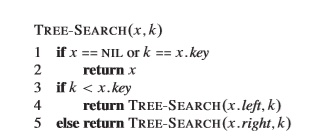
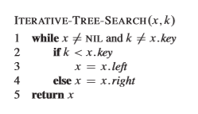
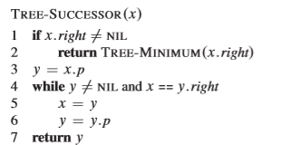
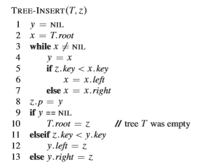
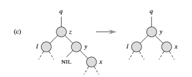
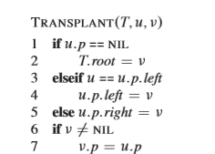
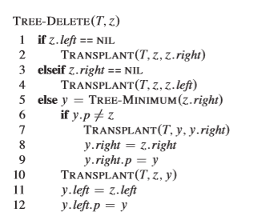

- 二叉搜索树
    - 对于节点x，x 左子树 任意节点 <= x，x 右子树 所有节点 >= x；附：堆是指根大于（或小于）他的子树的任意节点
    - 遍历O( n )
        - 前序：根 左 右
        - 中序：左 根 右 （对于二叉搜索树，输出是一个排序数组）
        - 后序：左 右 根
- 查询（本质上是一个二分）
    - 递归代码 
    - 迭代代码（效率更高） 
    - 最小最大值
        - 最小值（最左的叶子节点） 
        - 最大值（最右的叶子节点） 
    - 查找后继
        - 后继：对于x，x的后继是**大于x节点**中**最小的**那个节点（从大到小排序，x后面的那个元素，中序遍历之后的那个元素）
        - 对于查找后继有两种情况（节点的右子树和父节点          都可能大于x；其中父节点更大） 
            - 右子树非空：右子树中最小的那个元素（1~3）
            - 右子树空：（书上： if the right subtree of node x is empty and x has a successor y, then y is the lowest ancestor of x whose left child is also an ancestor of x. ）（4~6）
                - 该节点是右孩子：找1、最低的 2、是左孩子的父节点
                - 该节点是左孩子：父节点
- 插入和删除
    - 插入
        - 插入节点z是作为一个叶子节点插入
        - 查找到叶子节点的父节点x
            - z.key >= x.key && x.right = NIL
            - z.key <= x.key && x.left = NIL
        - 代码（3~7行即为查找对应父节点） 
    - 删除，删除节点为y
        - 情况
            - 简单 
                - 没有孩子----------------------直接删除
                - 有左孩子或右孩子---------用孩子替换
            - 复杂
                - 有两个孩子-------------------找后继y（右子树最小的那个元素）（附：删除操作类似于先删除y再用y替换z）
                    - z的右节点为y的左节点NIL，则y即为后继 
                        - 直接用y替换
                    - z的右节点的左子树不为空，则为左子树中y节点的左子树为空，则该节点为后继 
                        - 先用y的右孩子替换y，x替换y
                        - 用y替换z
            - 
    - 代码
        - 子过程：一棵u为根节点的子树        替换          一颗v为根节点的子树 
            - 1-2处理u为根节点：直接替换
            - 3-4处理u为左孩子
            - 5处理右孩子
            - 附：没有更新使得u的左子树和右子树的父节点变为v     (该函数只负责执行子树的替换)
        - 删除过程 
            - 1-4处理简单状态(附：当无孩子，可以用NIL替换)
            - 5-12 复杂状态
                - 5找后继
                - 6-8：复杂状态2
                    - 删除节点y(将y的右孩子替换y)
                    - 将y作为r的父节点（即变为复杂状态1） 
                - 10-12：复杂状态1
                    - 将z的右子树替换z
- 随机构建二叉搜索树？？？？
    - 
