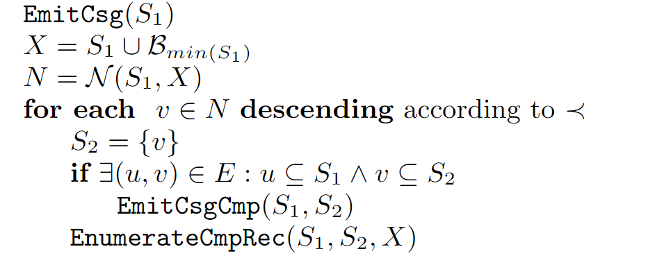

- 联通子图算法
    - 考虑常规的Dpsub
        - 我们需要从小到大的所有子集
        - 当枚举大的子集的时候，可以分解为两个小子集的组合
        - 问题是，组合不一定存在
    - Dpccp，通过引入了csp-cmp解决关系
        - 我们需要从小到大枚举所有的**联通子图**
        - 通过联通的csg-cmp pair的组合来解决更大子图的问题
    - 基本的算法流程
        - 找到一个子图
        - 找到这个子图的邻居
        - 根据邻居扩张为更大的补图
        - 将补图和子图合并一个更大的子图并求其解
    - 核心步骤
        - 如何找邻居
        - 如何枚举子图
- Neighborhood定义
    - 对于一个边的集合​，我们定义其最小集为​​​​​​​​​​​
        - 其满足条件​​​​​​​​​​​​​​​​​​​​​​​​​​​​​​​​​​​​​​​​​​​​​​​​​​​​​​​​​​​​​​​​​​​​​​​
    - 在实际算法中，我们还需要过滤掉一些在​中的节点 
    - 由此我们便可以得到邻居 
- 实际算法
    - `solve`算法是最外层的调用算法，其对每个节点枚举子图和联通子图（相当于以N个节点为根节点？） 
    - `EnumerateCsg`：递归的扩张子图，扩张的方案是先包括邻居，再包括邻居的邻居（有点像广度搜索 
        - `EmitCsg`：会实际的生成出子图和其补图 
