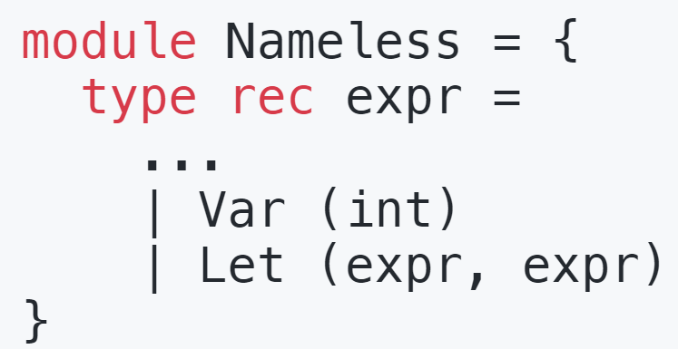
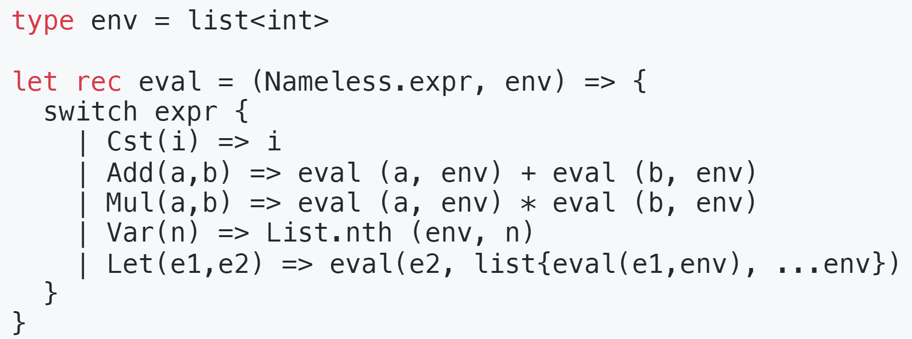

- 从设计一个语言开始，表达式evaluation 语言
	- Tiny Language 0：我们使用Add来构建抽象语法树，避免具体的语义
	  {:height 147, :width 499}
		- 如果我们想要解释它的话，可以使用模式匹配来递归执行
		  collapsed:: true
		  {:height 135, :width 383}
			- 上述的执行语义可以转为数学符号描述，formalization
				- 定义基本的term：符号，和值范围values
				  {:height 68, :width 523}
				- 对于上述的三条执行规则，我们可以用数学语言描述
				  
			- 上述的执行过程依赖于一个语言栈，即我们需要保存临时变量
		- Lowering to a stack machine and interpret：引入一个存储栈去执行
			- 定义基本操作
				- 指令
				  
				- 程序
				- {:height 53, :width 486}
				- 操作数
				  {:height 40, :width 352}
				- 数据栈
				  {:height 43, :width 474}
			- 基于栈的数据操作
			  {:height 215, :width 522}
				- Cst：将数据压入栈顶
				- Add|Mul：取出栈顶的两个元素来操作
			- formalization
				- 压栈出栈的数学符号
				  {:height 107, :width 500}
				- 基本的操作指令和数学符号的映射
				  
				- formalization
					- 这里我们使用方括号表示编译，即将上述函数翻译为一系列指令，我们得到对语言的编译规则为
					  {:height 152, :width 492}
					- 对于一系列指令，我们编译到最后，使得栈上只有一个值，这个值就是执行结果
						- 栈平衡：在执行后，栈只会包含一个值
					- 编译对应的语义为
					  {:height 76, :width 426}
					-
			-
			-
			-
	- Tiny Language 1：引入一个有名变量
	  collapsed:: true
	  {:height 131, :width 485}
		- 这里语言的执行过程和Tiny Language 1类似，不过我们引入了一个环境保存变量
		  {:height 225, :width 627}
			- 这里引入一个三元表达式，语义为 let (x, e1, e2): e2 是包含x的表达式，其中x = e1
		- formalization
			- 符号定义
			   {:height 69, :width 714}
			- 一些标记，取值和赋值
			  
			- 执行规则
			  
		- 上述执行过程的问题是，我们需要通过变量名寻址，变量名寻址比较低效可以直接转为一个栈，利用索引寻址
	- Tiny  Language 2：将有名变量转为无名变量
	  {:height 180, :width 341}
		- 构造一个使用语言栈的evaluation过程
		  {:height 222, :width 580}
			- 该构造过程引入了一个二元函数，let(e1, e2): e1 作为e2 的变量
			- 上述语义同样也可以使用数学公式表达
			  
				- 其中s表示的是执行环境，即临时变量存储的栈
		- 同我们可以将一个有名的expr翻译为Nameless的expr
		  
			- 这里将加一个cenv，即编译时的环境，用来存储变量名
			- 这里我们通过index(cenv, x)找到对应变量的索引
		- 同样我们期望将其编译为一系列的指令
			- 为了编译无名
			-