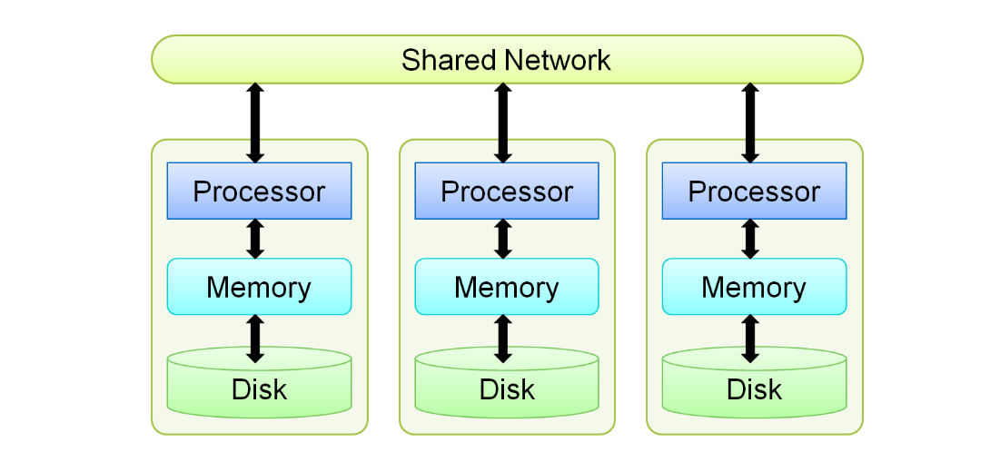
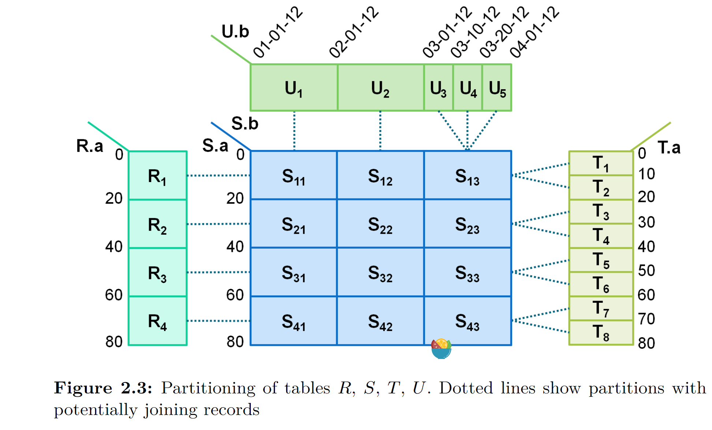
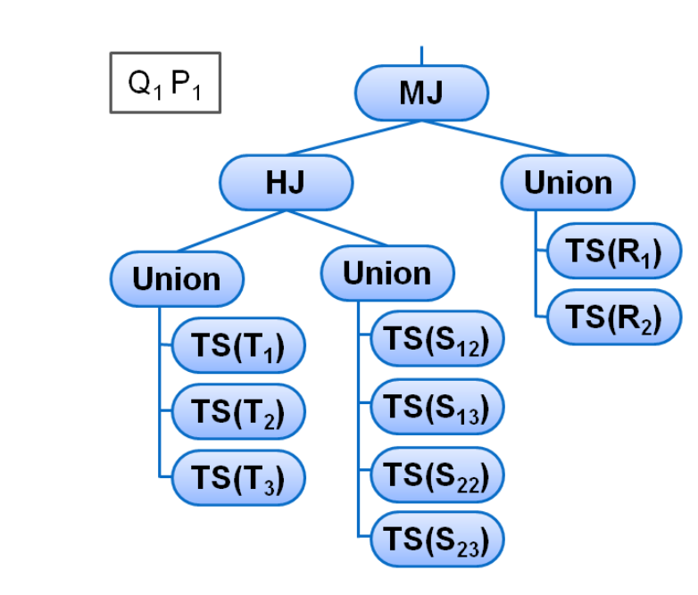
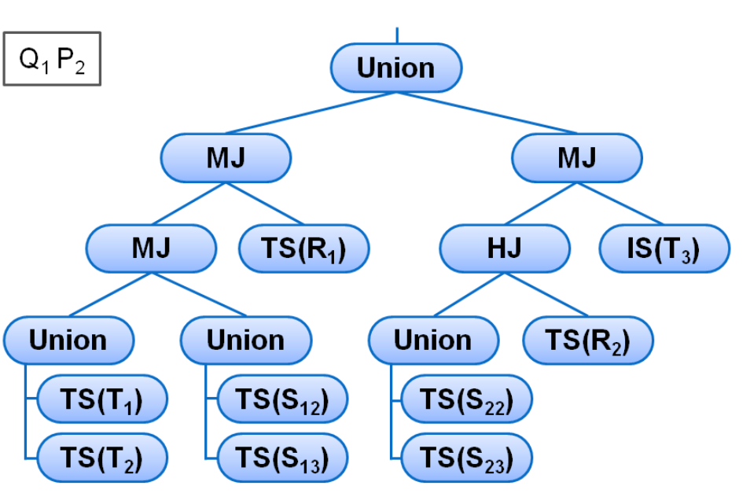

- Introc
    - 大数据的趋势
        - 公司收集越来越多的数据
        - 数据既包含结构化的也包括非结构化的
        - AP和TP的时间间隔很短
    - i类别
        - 经典系统
        - 列式存储
        - MapReduce
        - Dataflow
        - HTAP
    - 特征
        - Data model 和 interface
            - 关系模型和SQL
        - Storage Layer
            - 传统数据库耦合存储引擎
            - MapReduce使用独立的文件系统
        - Execution Engine
        - Query Optimization
            - 计划空间
            - rule based / cost based
            - 代价模型
        - Scheduling 调度计算任务
        - Resource Management  资源利用率
        - Fault Tolerance
        - System Administration ：需要管理者干预的程度
- Classic Parallel Database Systems
    - 经典架构：**share-nothing** share-memory share-disk 
    - data model and interfa：Relational model && SQL
    - Storage layer
        - Partition：如何划分表
            - 水平划分
                - 划分方式
                    - Hash partition：基于hash值划分
                    - List partition（range partition？）：基于指定的集合划分
                    - random （round-robin） partition：交替分配
                    - Block partitioning：划分连续的块作为一个partition
                - Skewed partition
                    - 基于值的划分（比如range partition/hash partition）会由于数据本身的分布倾斜而导致skewed partition
            - 垂直划分（列存中常用
        - Assignment：如何将表分配到具体的节点上
            - 影响因素1：Degree of declustering
                - full declustering：将数据分配到所有节点
                - partially declustered：创建一个子集node group，分配到这个子集中
            - 影响因素2：Collocation
                - 对于两个表S、T，如果它们使用一个hash function且被分配在一个node group，那么join可以直接join
                - 对于合取谓词，不适用（或者可以先做一个，再做另一个） 
            - 影响因素3：Replication
                - 数据会在不同的节点复制（如何复制
                - 不同副本的划分方式可以不同
    - Execution Engine
        - 优化 --> 分解 --> 调度
        - Parallel Query Execution
            - 一图流 ​​​​​​​​​​​​​​​​​​​​​​​​​​​​​​ 
            - collocated join（Colocate join）
                - 如果多个表以相同的hash 函数被分配到同一组hash 函数
                - 且谓词只涉及一个表
                - 那么就不需要transfer data，只做本地join
            - directed join（感觉和broad cast join区别不大）
                - 首先会将R的所有partition汇聚到一起
                - 然后对每个S的partition进行join
                - 类似于nest loop join，对外面的先汇聚，里面的可以一个一个partition做
            - repartitioned join（shuffle join）
                - 将表用同一个hash函数重新hash一遍join的表
                - hash join
            - broadcast join
                - 将小表传给每一个节点，然后join
                - 和 direct join的区别？
        - 并行化分解
            - pipelined parallelism (Inter operator)
                - Pipeline，使得多个operator之间并行 
            - independent parallelism. (Intra operator)
                - 使得单个operator并行处理数据
    - Abstractions for Data Transfer（如何在operator间通信）
        - split table （Gamma）
            - 保存了数据和目标节点的映射关系（通过hash key）
        - table queues（IBM DB2）
            - 在consumer和producer之间的一个buffle
            - 可以重定向数据
            - 可以控制生产者速度
        - exchange operator （Volcano）
            - 包括很多
            - 待看
    - Query Optimization
        - 主要任务
            - Join ordering
            - Access path
            - Cost function
        - 2-阶段
            - rule based
            - cost based
        - 分布式的优化器
            - 在share nothing需要面对的东西更多（本质上是cost metric 更复杂）
                - 由于可以并发执行join，所以有些bushy tree更由于left deep tree
                - 由于数据存在多个节点，需要考虑网络开销（有些Colocate 的 join更快）
            - 新的操作符
                - semi join
                    - 通过join 条件预筛选数据，然后广播 
                - partition wise join
                    - 考虑一个语句 
                    - 考虑其划分为 
                    - 可能的划分
                        - Use of filter conditions for partition pruning：
                            - 我们可以根据partition的条件的条件直接去除不符合条件的分区（比如上述的range）
                        - Use of join conditions for partition pruning
                            - 根据join 条件来去除根本不可能匹配的分区
                        - Partition-aware join path selection
                            - 基于分区来选择join计划
                            - 例子
                                - 计划1（worse case） 
                                - 计划2（better case） 
    - Scheduling
        - 执行计划
            - 执行计划可以看成是一个DAG
            - 其节点是数据的 producer 和 optimizer
        - 如何调度任务
            - 调度和优化器耦合
                - 在优化的时候，使得每个计算尽可能的靠近数据
            - 单独的调度算法
                - 静态调度算法：shelf algorithm（拓扑排序）
                    - shelf 个数即为DAG的最长path的长度
                    - 每个shelf中会包含并行执行的计算任务（DAG无依赖关系
                    - 缺点：如果节点运行超时，则无法处理，为解决此问题，引入动态调度算法
                - 动态调度算法
    - Resource Management
