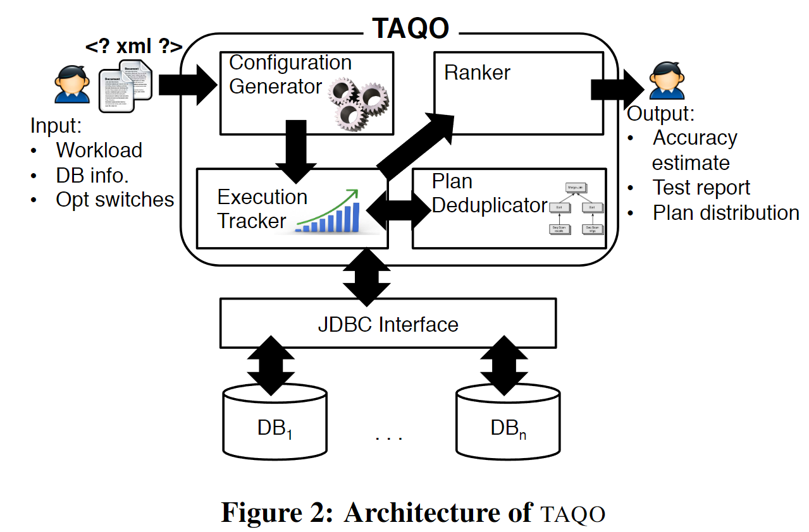

- 问题：如果评估优化器优化的计划是最优的
	- cost 和 执行时间是否正比
	- cost 很难调优，和系统的硬件有很大搞关系
- key idea
	- 使用hint or switch 来控制不同的plan生成
		- 生成的模型需要尽可能的在枚举空间中均匀分布
	- 比较这些不同的plan的执行时间和代价模型
- 测试框架：TAQO
	- 测试空间
		- 对于一个采样空间$Q = \{p_1, ...\}$，我们希望
		  $$cost_i \leq cost_j \Leftrightarrow time_i \leq cost_j$$
		- 当全局空间过大时，我们会均匀采样n个计划
		  $$S_Q = \{p_1, p_2,...,p_n\}$$
	- 测试指标
		- 影响因子
			- Discordance of plan pairs：执行时间和代价的相关性
				- Kendall’s Tau rank correlation
			- Relevance of plan：对于那些更优的计划，给予更大的权重
				- 权重指数
			- Pairwise distance：排序错误的影响和执行时间的差距有关，执行时间差距越大，错误的影响越大
				- 距离指数
		- 衡量公式
			- 。。。
		- Normalization Across Systems
			- 对于不同的系统可能会生成不同数量的计划，所以只选择k个
			- 使用标准算法去除离群点
		-
	- 实现架构
		- 架构图 
		  {:height 319, :width 471}
			- Configuration Generator
				- 设置不同的switch \ hint
				- 枚举出所有可能的配置
			- Plan Deduplicator
				- 解析执行的计划
				- 删去重复的计划
			- Execution Tracker
				- 重复执行语句，来避免系统波动的影响
				- 对于执行时间过长的语句直接终止
			- Ranker
				-