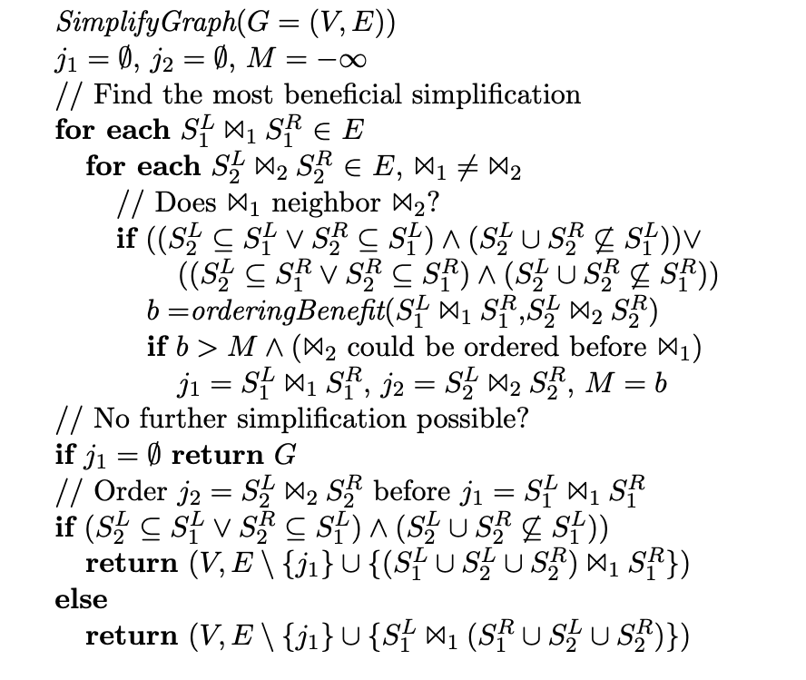
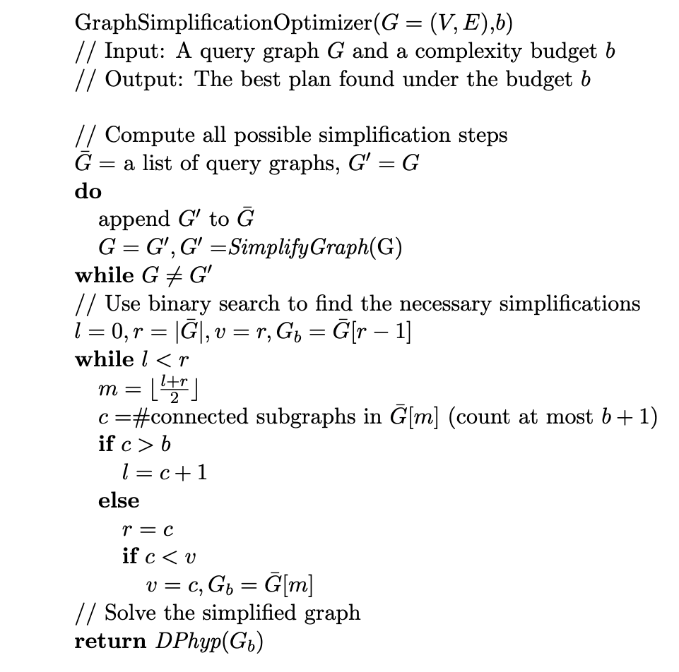

- 例子 
	- 对于原图，可能有6种计划，​​​​​​​​
		- ​​​ 必须在第一位，或者第二位
		- 其他三位任意
	- 第一步：使得​​​​​​​​​​​​​​​​​​​​​。
		- 如果​​​​​​​​​​​​​​​​​​​​​​​​​​​​​​​​​​
			- 所以我们希望​​​ 出现在 ​​​ 之前，通过加入一条语句使得​​​ join之前必须​​​​​​​​​​​​​
		- 剩下6条（考虑之前两种情况，一半一半）
	- 第二步：使得​​​ 出现在​​​ 前：4种计划（​​​，只能出现在第二位）
	- 第三步：使得​​​出现在​​​ 前：2种计划，只有​​​​​​​​​​​​​​的顺序可以改变
- 简化算法：贪心
	- 伪代码 
		- 找到收益最大的相邻算子对：指它们至少有公共的table输入
			- 如果​​​​​​​ 的算子的产出全在 ​​​​​​​ 的一边，在这种情况下是没有办法优化的，因为已经确定好了顺序
			- 只有有公共relation的才有意义，因为对没有公共relation，它们之间的顺序其实取决中间的算子谓词。很难建模
		- 固定这对相邻算子的顺序
			- 如果 ​​​​​​​​的部分输入在左边，那么就固定在左边，加入一条边：​​​​​​​​​​​​​​​​​​​​​​​​​​​​​​​
			- 同理
		- ？？？ 
- full algorithm
	- 由于计算终止条件不是trivial的，也就是simplify的代价远低于计算图的复杂度代价
	- 所以我们先算出所有的simplify，然后再计算有效的图 
		- 注意我们并不实际生成图，2而是生成每一步的操作，也就是上述的​​​​​​​​​
		- 然后再通过apply 这些步骤得到我们想要的图¥
- ordering benefit
	- 计算实际的order的收益 
	- 上述公式有时过于理想
		- 1.有公共的表不一定代表X会完全相同，所以我们取最大的 
		- 2. 代价函数我们只选取最简单的基于cardinality的估计
- 理论证明
	- 为了保证上述过程不破坏最优解，代价函数需要满足 
	- 尽管如此，还是可以在star query中，做出一些保证 