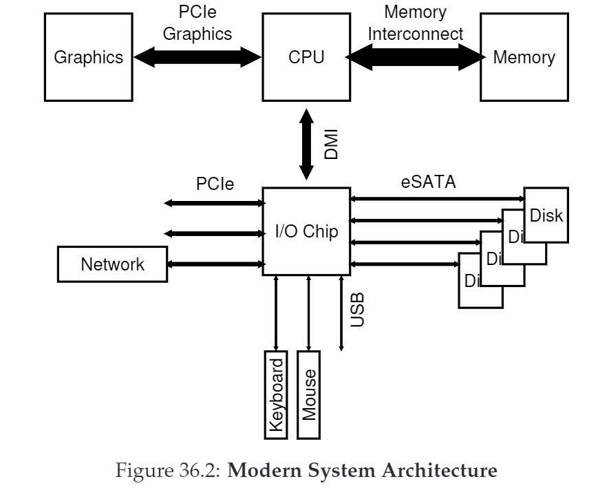
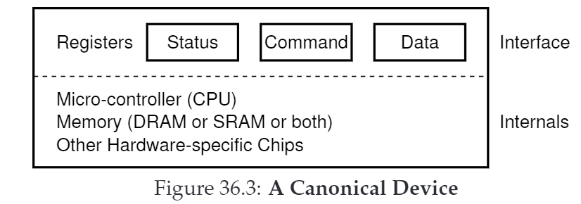
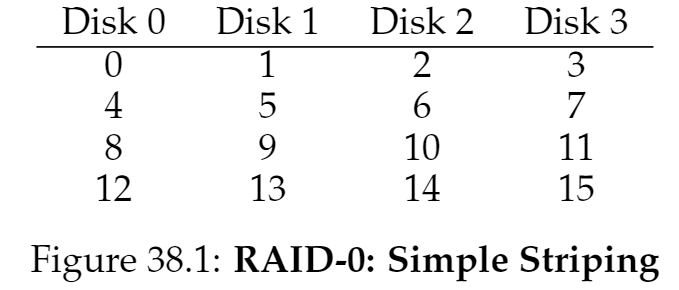
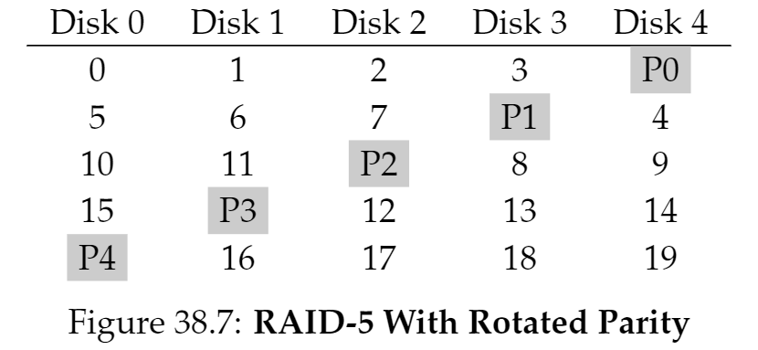
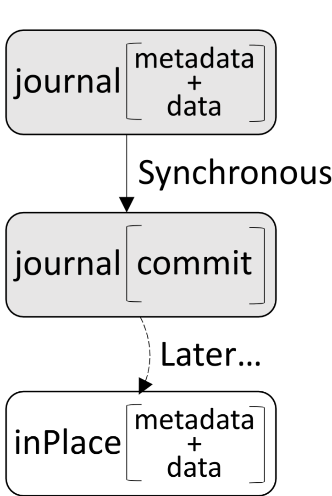
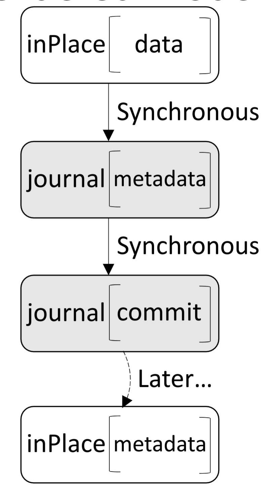

- I/O Devices
	- 系统架构 
	- 设备的架构 
	- 访问设备的方式
		- poll：同步轮询，直到ready
		- Interrupts：通过中断通知
		- DMA：将数据的移动转为DMA完成
	- 设备io的指令
		- 特殊指令：in/out
		- 将地址映射到设备
	-
- Hard Disk Drives：略
- Redundant Arrays of Inexpensive Disks(RAIDs)
	- 评价指标
		- performance
		- 容错性
		- 容量
	- raid0 
		- 无容错性
	- raid1 
		- 容量牺牲太大
	- raid4 
		- 每次写的时候需要更新parity（通过异或）
		- 这样对于写操作，写parity是瓶颈（因为只在一个磁盘上，必须串行写）
	- raid5 
- 文件系统实现（vsfs: very simpler file system）
	- 磁盘抽象：一串数组 
	- 分区： 
		- 数据区：保存数据
		- inode区：保存文件的low-level name
		- i：inode 位图，便于查询空闲位图
		- d：data block位图，便于查询空闲数据块
		- S：super block，保存了该文件系统的一些元信息
	- inode：文件的索引，便于查询文件的所有数据
		- 时间/权限/拥有者/引用数等等
		- 数据的索引方式
			- pointer方式：
				- 一级指针：直接指向block，其保存的文件大小为：​​
				- 二级指针：指向包含一级指针的block，其保存的文件大小：​​
				- ....
			- 链表方式：每个数据块保存指向下一个数据块的指针（对于非顺序访问不友好）
	- directory：文件夹也是一种文件夹
		- 有inode和数据块
		- 数据块中保存的是 <文件名，inode编号>的映射
	- 链接
		- 硬链接：在文件夹中，保存文件名->inode编号
		- 软连接：建立一个新的文件，保存文件名及其链接路径
	- 读写
		- 读：给定一个路径 
			- 先找到root inode
			- 然后逐步找到对应文件夹的inode
			- 然后找到文件的inode
			- 然后读取文件
		- 写：给定一个路径 
	- buffer & caching
		- 将一些频繁使用的inode（文件夹的inode）保存在内存中
		- 将多次写合并为一次
- The Fast File System
	- 磁盘的结构： 
		- 在同一个圆柱下的读写会更快
	- 思路：将有关联的数据放到同一个Cylinder Group
		- 同一个文件夹的文件放在同一个group
		- 等等？
- Crash Consistency: FSCK and Journaling
	- FSCK：通过扫描磁盘校验，太慢
	- Journaling：Write Ahead Log
		- Data mode 
			- 缺点：数据会被写入两次，造成大量的I/O
			- 优化：为了防止commit的异步写入，可以在commit中添加校验码校验数据的完整性
		- Ordered mode 
			- 防止来数据的重复写入
			- 可能会造成脏数据？
				- step1 覆盖某个文件，写到一半crash，造成了脏数据
				- 通过原来的meta data 访问到脏数据
		- Block reused：有点没看懂