- CPU virtualization
  title:: tep-Virtualization
	- Process
		- 核心：通过time sharing 来 得到多个cpu的虚拟
		- 策略与机制：策略与机制分离
			- 策略：提供一种选择，即which
				- 根据不同的策略调度进程
			- 机制：提供一种实现，即how
				- 提供进程切换的实现
		- 核心接口：
			- creat
				- 加载program到内存
					- 一种优化：懒加载，当需要的时候才加载对应的库
				- 执行
			- destroy
			- wait
			- Miscellaneous Control：比如信号？
			- Status：进程的状态
		- 模型 
		- unix api
			- fork & exec
				- fork 和 exec 一个有趣的例子：重定向
					- ls > a.txt
					- fork
					- 关闭stdout，打开a.txt
					- exec ls
			- wait
			- kill
	- Mechanism:  Limited Direct Execution
		- restricted operation 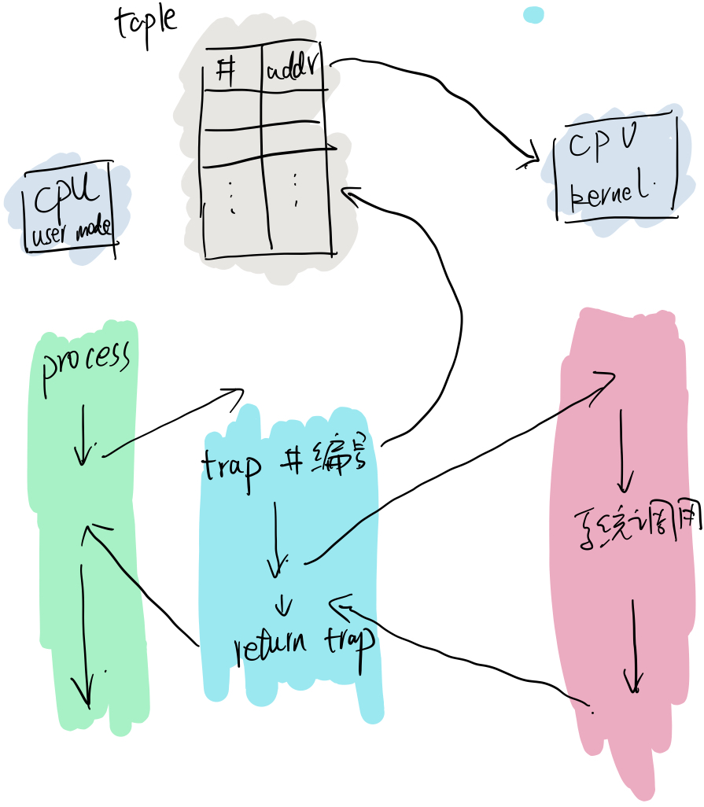
			- 虚拟化：时分复用，即将cpu的控制权交给线程
			- 问题：如何保证该线程执行一些restricted operation
				- 比如访问磁盘，或者其它受限资源
				- 为了安全，不可能允许
			- 思路：通过系统调用
				- cpu分为两种模式
					- user mode：只能执行普通操作
					- kernel mode：可以执行一些特权操作
				- 通过系统调用，使用trap指令陷入kernel mode，return-trap返回
					- 如何确定trap跳转的地址
						- 不能直接指定，一个是硬编码，不好迁移
						- 还有trap指令时还是user mode？
					- 通过trap table：trap编号到trap address的映射
						- 系统在boot的时候创建一个trap table，并将trap table的初始地址加载到cpu 一个专门的寄存器中
						- 在trap时，压入一个编号
						- cpu自动访问对应trap handler 的地址
			- 流程 
		- Switching Between Processes
			- 问题：当cpu的控制权，被用户拿走后，我们如何切换他呢
			- 思路
				- 理想的合作办法
					- 每个进程都会在获取一段时间cpu后，触发中断
					- 以此保证内核能够获取cpu
				- 非理想的
					- 时钟中断：每隔一段时间都会固定的触发时钟中断
					- 当触发时钟中断时，内核就会进行调度，选择下个执行的进程
				- 示例： 
					- 在触发中断时会由硬件自动的保存context
					- 在调度的时候，会由os来调度，选择性的保存和恢复context
	- Policy: schedule
		- basic
			- 周转时间：finish time - arrive time
				- FIFO：周转时间比较长，短作业可能会等长作业 
				- SJB：到达时间不统一，这样的话就退化到FIFO了 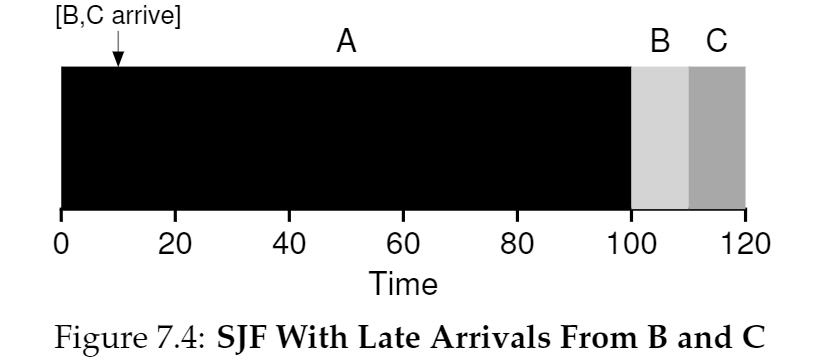
				- Shortest Time-to-Completion First (STCF)：抢占式的，先完成的会抢占cpu 
				- 有I/O的情况
					- 当STCF遇上I/O时 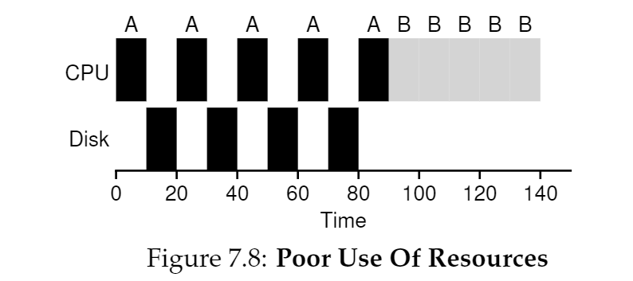
					- 解决思路：将A的每10ms的作业都视为一个sub job，这样就可以正常的调度了 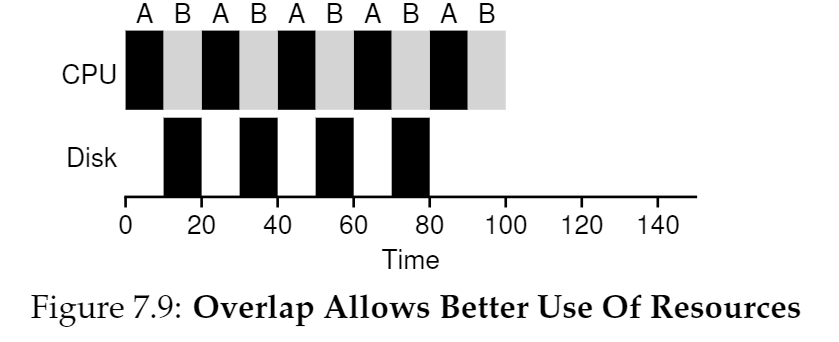
				- **缺陷**
					- **上述方法在周转时间上都很优秀，但是响应时间上表现不好**
					- **而且我们无法知道进程的持续时间，所以短作业优先不太现实**
			- 响应时间：first run time - arrive time
				- RR：循环调度
					- 将CPU分成一系列CPU 时间片，然后循环调度
		- Multi-Level Feedback Queue：在不知道每个job的持续时间时，尽量优化周转时间
			- 核心思路：通过作业的行为来判定它是长作业还是短作业
			- basic
				- 设置：多个queue，越高的queue优先级越高
				- basic rule 
				- 调度规则
					- 所有的作业一开始是最高优先级 
					- 随着不同行为来更改： 
						- 如果时间片被跑满，说明它可能是长作业，所以会下降优先级
						- 如果时间没有被跑满，说明它可能是交互性的作业，保持优先级
			- basic问题
				- 饥饿问题：有些长作业可能会在底部一直被抢占
				- 有些作业的任务可能会改变，比如有时候是交互性的，有时候是计算性的
				- 恶意作业：有些作业可能会通过触发I/O，来恶意占满CPU
			- 解决方案
				- The Priority Boost
					- 会隔一段时间将全部作业提升到最高queue 
					- 这个可以解决饥饿问题和作业变化问题
				- Better Accounting
					- 给每个作业分配一个cpu额度，当额度用完就会降级 
			- Summary 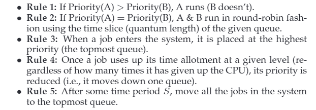
		- Proportional Share
			- 目标：每个job 按一定比例占用cpu
			- 核心思路：ticket
				- 每个job 都会有一些ticket
				- 调度器会有一个全局ticket总数
				- 每次调度选取随机数：
					- 随机选取一个随机数，[0, ticket)
					- 看这个随机数落在哪个区间，就运行哪个作业 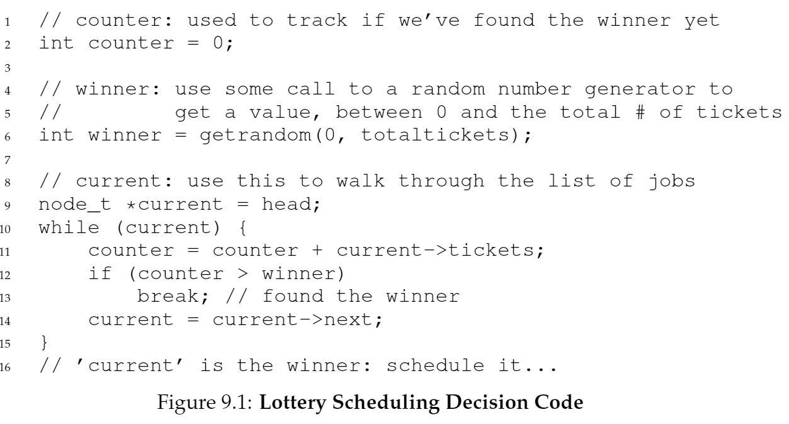
			- stride schedule
				- 随机ticket有一个缺点，就是在较长时间内才会达到想要的比例
				- determine
					- 初始化
						- 每个job保存一个初始值0
						- 每个job按照其拥有的ticket数，设置一个stride：stride = n/ticket
					- 每次调度的时候
						- 选取最小的值的job，运行
						- 并将最小值的job的值+stride
				- 举例
					- 假设A、B、C的ticket分别是：100，50，250
					- stride = 10000/ticket
					- 运行情况 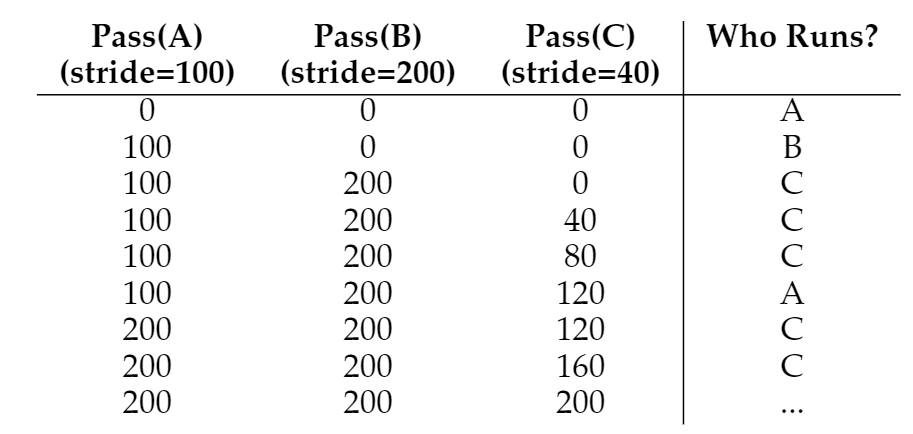
				- 缺陷：需要保持一个global state
					- 当新加入一个job，无法确定其初始值
						- 如果初始化为0，则导致其可能长期占有cpu
						- 或者将当前的value，随机选取一个，赋给新job？
			- The Linux Completely Fair Scheduler (CFS)：简略版
				- basic：保证公平
					- 每个进程都有一个运行时间：virtual runtime(vruntime)
					- 当进程运行时间片，会增加vruntime
					- 每次调度时，选择最小的vruntime
					- 时间片设置：
						- 这里有两个参数sched_latency, min_granularity
						- n_process为当前运行的进程数量
						- time_slice = max(sched_latency/n_process, min_granularity)
					- **所以新加入的job如果设置权重？当前最小的**
				- 引入权重
					- niceness：越nice的权重越低，越不需要调度器关注，取值范围为[-20, 20)
					- 每个nice值和权重关联 
					- 时间片计算为： 
					- vruntime更新为：相当于只运行了一个标准时间片 
				- 组织的数据结构
					- 红黑树：插入和查找较快
				- I/O或sleep操作
					- 当进程sleep时，会移出调度队列（红黑树）
					- 当进程进入的时候，会设置当前红黑树最小的vruntime
						- 防止新的进程垄断cpu，毕竟一段时间没有执行
						- 会破坏公平性
- memory virtualization
	- Addresss Space
		- 为了更好的管理内存，特别是在多进程运行的情况
		- 为每个进程所使用的内存，统一的抽象为一个模型：address space 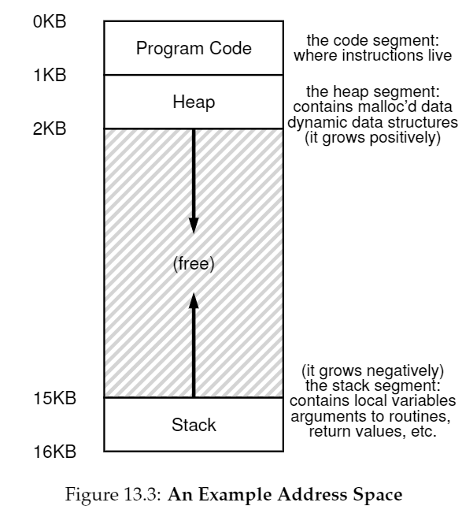
			- 上述只是C语言中的address space
			- 而且在低地址区域可能有一些其它的代码
			- 可参见<a  href="https://www.xsegment.cn/2020/01/04/MIT6-828-OS-lab2/">https://www.xsegment.cn/2020/01/04/MIT6-828-OS-lab2/</a>
		- 每个address space都是虚拟的，它的物理内存可能是杂乱分布，通过一个表映射到物理内存中
	- Address Translation
		- 回忆对CPU虚拟化提供的机制：LDE
			- 大部分时间让进程直接在cpu上运行
			- 在关键时刻将控制权返回给操作系统，保证一些操作的安全性
				- 通过中断
				- 为了更有效的实现，提供硬件支持
					- CPU执行的特权标志位
					- 信号handler的地址表地址
		- 对内存的虚拟化：虚拟地址到物理地址的映射方式
			- 做一些基本假设
				- 每个进程的虚拟内存映射到物理内存都是连续的
				- 每个进程的所需虚拟内存都是固定的，并且小于实际的内存
			- Dynamic (Hardware-based) Relocation
				- 添加两个寄存器：
					- base：开始
					- bound：边界，为了protection
				- 映射方式
					- `physical address` = `virtual address` + `base`
				- 运行方式
					- 加载某个指令
					- 将指令中的地址翻译为物理地址
					- 执行
				- 内存管理：类似对堆的内存管理
					- 通过freelist
					- 每次free添加到freelist中去
					- 每次malloc都要在freelist找
				- 缺点
					- 段内碎片：每次都是分配固定大小的内存给进程，但是进程可能其中一些堆栈内存不会使用 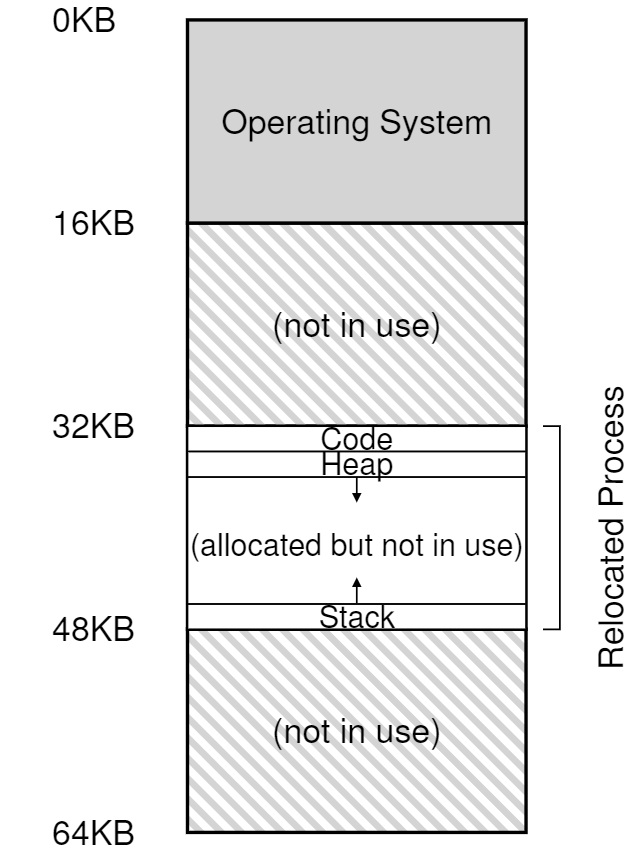
		- 总结
			- 额外添加内容
				- 硬件支持 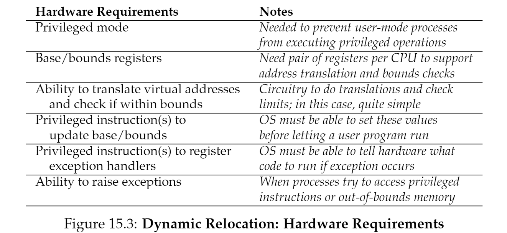
				- 软件支持 
			- 然后外面可以总结系统目前为止所需要做的
				- boot 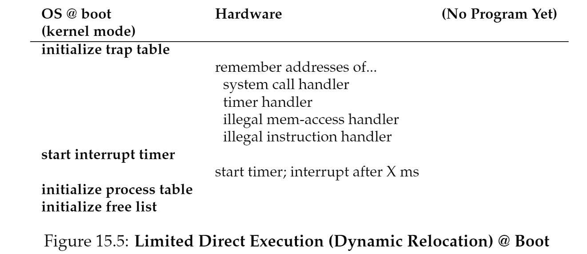
				- 使用 
	- Segmentation
		- 引子
			- 之前提到的一个假设是每个进程都有固定大小地址空间
			- 每个进程有一个base/bound寄存器管理
			- 有内碎片问题
		- 解决思路
			- 每个进程有多个段：segment
			- 每个段划分一个base/bound寄存器管理
			- 一开始可以划分比较小的空间，然后通过系统调用增长
		- 一些设计的细节
			- 段的划分：
				- 代码段
				- 堆
				- 栈
			- 如何确定当前地址是哪个段的：根据address space，栈是向上增长，其它的是向下增长
				- 显示：将地址前几位作为flag，标志地址是哪个段的
				- 隐式：通过场景判定：比如从PC拿到的就是代码段，从系统调用中拿到的是堆等等
			- 段的共享
				- 可以将一些代码段共享
				- 共享需要注意protection，设定段的保护位
			- 总结 
		- 问题
			- 代码段是可变空间的划分，容易造成外部碎片
				- 最佳适应
				- 最坏适应
				- 伙伴系统等等
			- 段内空间的稀疏分布
				- 如果段的划分不合理，导致段内有很多空洞，也会导致空间的浪费
	- paging
		- introduction
			- 将内存分为固定的page
			- 机制：假设内存拿到一个虚拟地址（硬件操作）
				- 根据mask，找出虚拟页编号+虚拟页偏移量
				- 根据PageTableBaseRegister保存的页表基址，访问页表项
				- 根据页表项+偏移量计算物理地址
				- 根据物理地址访问对应地址 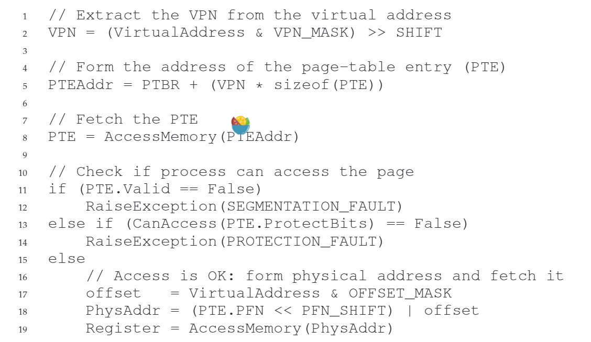
			- 问题
				- 页表size过大
					- 每个进程都要单独的存储一个页表（每个进程都有相同的虚拟地址空间）
					- 每个页表的大小是：​​
						- 以4G内存（32bit），4kb页表（12bit）
						- 这样有1M（20bit）的页表项，如果PTE是4byte
						- 那么每个进程多存储4MB的东西
				- 速度影响：页表会多引入一次内存的访问开销
		- Faster Translations (TLBs)
			- 解决思路：通过cache抹平多的内存访问开销
			- 机制
				- 当需要转译虚拟地址时，查看TLB中是否有对应的
				- 如果有直接翻译，hit
				- 如果没有需要重新加载对应的表项进TLB，然后再执行：miss
					- 软件中断：通过软件触发中断，加载页表项
						- 和普通中断不同的时，该中断返回时是retry当前指令，而不是执行下一条指令
						- 需要避免级联中断，比如在访问中断handler时又触发了miss
							- 解决思路：在TLB中设置几个保留项，专门存储对应的中断地址
					- 硬件中断：触发硬件中断
			- 进程切换
				- 由于每个进程都有独立的进程表，所以当进程切换的时候，原有的TLB可能会造成confuse
				- 解决思路
					- 每次进程切换的时候都刷新TLB
					- TLB新加标志位，标志是哪个进程
			- 置换算法：可能是随机置换，比较简单
		- Smaller Tables
			- 问题核心：页表很大（32bit下4MB），但是其中有很多空洞，即未使用的表项
			- 更大的page size：带来更多的内碎片
				- 所以这存在一个trade off：页表的大小和内碎片
			- 段页式
				- 将一整个页表分为多个段（code stack 和 heap），未使用的entry
				- 但是对于段的划分是一个大问题，如何合理的划分段
			- 多级页表（段页式实际上也是多级页表？）
				- 引发额外的内存访问（TLB？）
				- 控制流 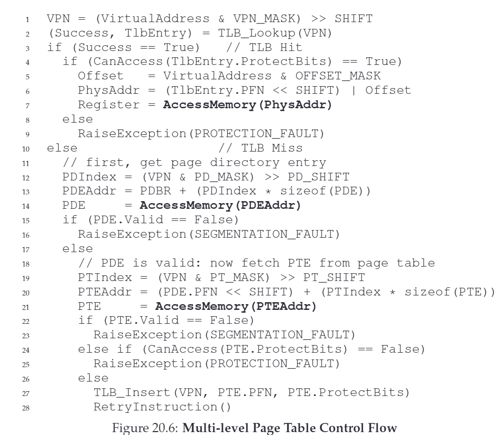
	- swapping
		- mechanisms
			- 部分页可以被置换到磁盘中
			- 页表
				- 标识该虚拟内存是否在内存中的present bit
				- 标识该页在磁盘中的物理地址
			- page fault
				- 当address translation的时候，发现地址的present bit = 0的时候，触发page fault：缺页中断
				- OS拿到控制权，做页面换入
			- 置换
				- 当页面换入的时候，可能会内存是满的，所以需要置换算法
		- policies
			- OPT：回收那个在未来最远会被使用的页
				- 理想化，没有办法知道未来的情况
			- 从历史出发
				- Random/FIFO：简单容易实现
				- LRU：Least Recently Use
					- 最近未使用的页，是根据时间局部性的：如果一个页最近被使用，那么它可能在不久的将来也会被使用
					- 实现：
						- 每次使用就要移动到队列尾部
				- LRU简化版：时钟算法
					- 设置一个use bit
					- 每次扫描，看use bit是否为1，如果不是，说明最近未使用，回收
					- 如果为1，那么设为0，移动到下一个页
				- LFU：Least Frequently Use
					- 最少使用，如果一个页被频繁的调用，那么它可能比较重要
			- Dirty Page
				- 脏页需要重新写入磁盘，需要更多的时间
				- 所以需要设置一个位标识是否位脏页
	- 实际系统设计
		- VAX/VMS Virtual Memory
			- Address Space 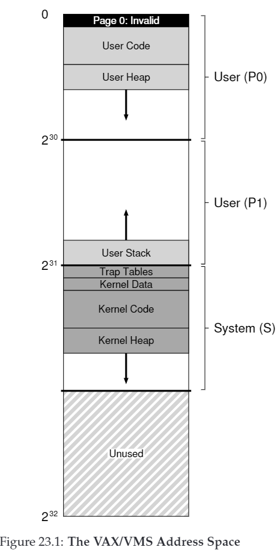
				- 将内存等分：上块是用户区域，下快是系统区域
				- 用户区域分为两段：P0，P1；逻辑上的段，避免堆栈之间的空洞页表项
			- 置换策略：两次FIFO（在没有硬件帮助下对FIFO的逼近，实际上也可以利用中断制造标记）
				- 先为每个进程的每个段设置一个FIFO队列，当需要回收时，evict队首
				- 将队首加入到系统新的队列的队尾：dirty FIFO/clean FIFO
				- 每次需要reuse 某个页的时候，会clean FIFO队首中选择
				- 当进程reclaimed 的某个页时，从二级队列取出
			- 一些其它的优化
				- 聚簇写：将多个页的请求聚集，一起写入
				- 懒优化？推迟操作到真正需要的时候？
					- demand zeroing
						- 每次分配物理页的时候都需要清0，时间开销较大
						- 所以每次分配的时候只是添加表项
						- 当进程真正开始读/写的时候才会中断清0
					- COW：COPY ON WRITE
						- 在拷贝的时候，并不会重新的分配一个新页，只是重新引用
						- 只有在写入的时候，才会拷贝
		- Linux
			- address space 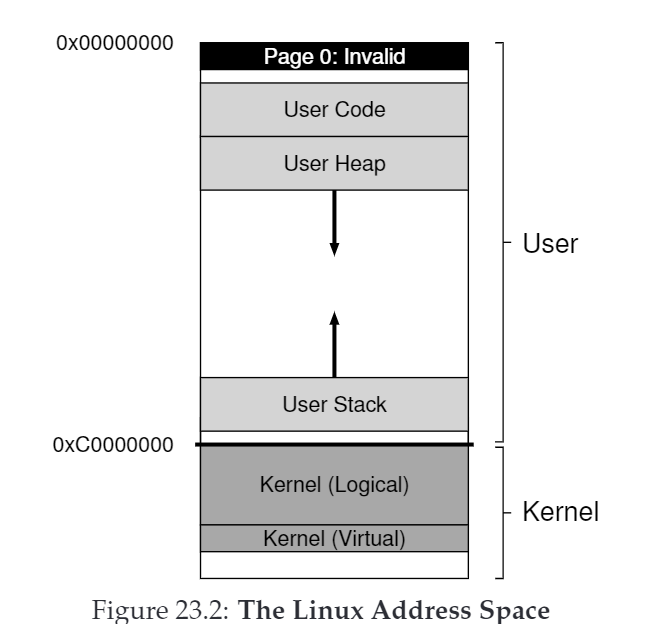
				- 内核分为两种
					- logical：只是简单的线性映射虚拟内存到物理内存（即虚拟地址=物理地址+base addr）
					- virtual：通过页表来控制
			- 置换算法：2Q
				- 设置两个队列：inactive queue 和 active queue
				- 当第一次加入系统时，进入第一个queue
				- 当被再次使用时，进入active queue
				- 置换算法从inactive queue中选取（LRU）
				- 同样也会周期从active queue置换到inactive queue（LRU）