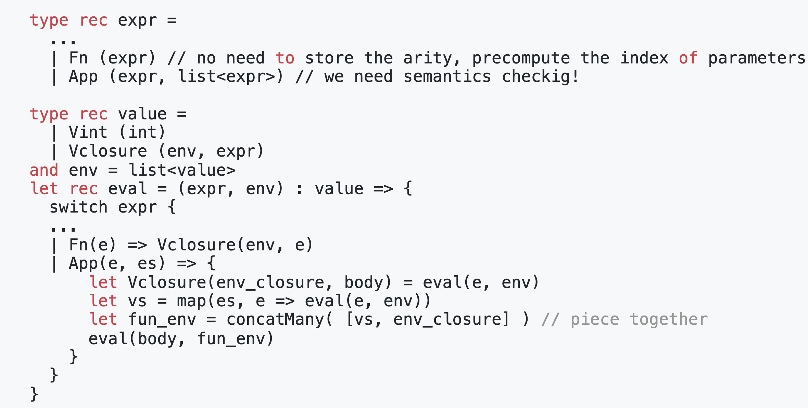

- 从引入函数开始（tiny language 3）
  collapsed:: true
	- 我们继[tiny language](((639b2805-145f-444e-805a-b0fe66998f11)))需要引入新的expr定义
	  collapsed:: true
	   {:height 113, :width 375}
		- 注意这里的Fn可以捕获环境变量，比如 x = 1 in func y -> x+y
	- 这里我们可以定义函数的解释过程
	  collapsed:: true
	  
		- 首先引入两个新的iterm：vadd，vmul。表示数的操作，引入这两个操作的原因是add的参数可以是函数调用
		- 然后对于函数的解释，我们会返回一个对象Vclosure，包含三个部分：环境env，参数定义xs，函数体 e
		- 调用函数的过程是：
		  collapsed:: true
			- 提取函数定义中的env，xs，e
			- 将parameter（形参） 和 argument（实参） 绑定，即作为一个新的参数环境：<parameter name, argument value>
			- 然后将捕获的环境和参数环境合并为一个env
			- 根据当前env执行函数体
	- 我们可以将上述语言转为Nameless Expr，上述的解释过程也不需要对应的参数
	  collapsed:: true
		- 转为Nameless Expr的本质是将所有的变量名都绑定到实际的栈地址上，所以解释过程和上述过程的差距是不需要任何有名参数
		- 解释过程
		  
			- 在这里，Fn 和 App都不需要参数
			- 在函数体中和所有的变量们都是当前执行环境env的索引，指向对应的环境变量
		- 如何计算对应的索引，homework
	-
- lambda calculus
	- Simplify tiny language 3 to lambda calculus
		- 对于let iterm，我们可以将其转为函数调用
		  $$let(x, e1, e2) = App(Fn(x, e2), e1)$$
		- 将所有的常量数转为函数（Church numeral）
		- 将所有的多元的参数转为单元参数（Currying，柯里化）
			- $$Fn(x_1, x_2, e) = Fn(x_1, Fn(x_2, e))$$
			- $$App(e, e1, e2) = App(App(e, e1), e2)$$
		- 这样我们就可以得到最简tiny language 3，类似lambda 演算
		  {:height 165, :width 467}
			- 变量名
			- 一元函数定义
			- 一元函数调用
	- Formally Definition
		- Lambda terms: $M,N ::= x|(MN)|(\lambda x.M)$
			- 其中小写字母x，作为变量名
			- MN: 是函数调用，即将N作为M的参数
			- $\lambda x.M$ 是函数定义，其中参数是x，函数体是M
		- computation
			- 计算过程也就是函数调用，称为 $\beta - reduction$
			- $\beta - redex$ 是一个term，形如 $(\lambda x. M)N$，表示$\beta - reduction$操作的对象
			- $\beta - reduction$ 是将 一个 $\beta - redex$ 归约到 $M[N/x]$，即将M里所有的x替换为M
			- 例子：
			  
		- Confluence of untyped lambda calculus
			- lambda 计算的结果和计算的顺序无关，也就是说我们可以随便选择一个 $\beta - redex$进行归约
			- 形式化的描述
			  
			-
-