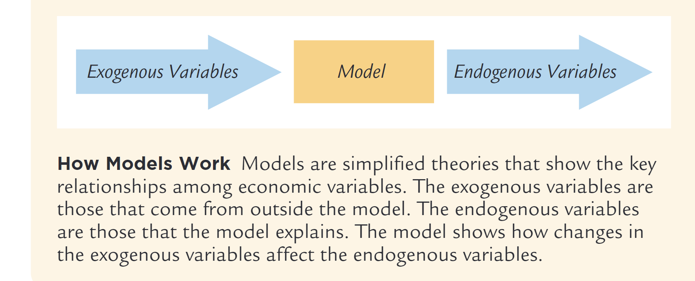

- Intro
    - 建模 
        - 基本思想：将经济学抽象为一个数学模型
            - 基础假设
                - 基本价格假设 
                    - market clearing：在长期市场，价格会快速变化（flexibility）使得供需平衡
                    - sticky：在短期市场中，价格会保存粘性（即基本不变）
            - 自变量（外部变量） 
            - 因变量（内部变量） 
    - 基本概念
        - Gross  domestic  product（GDP）
        - consumer price index（CPI）
        - unemployment rate
