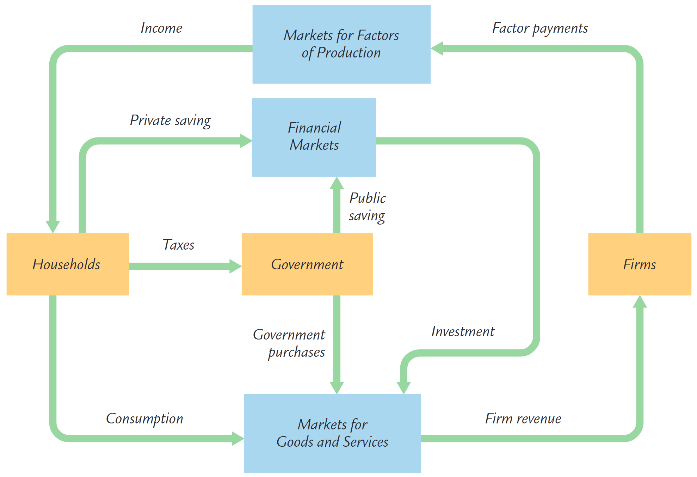
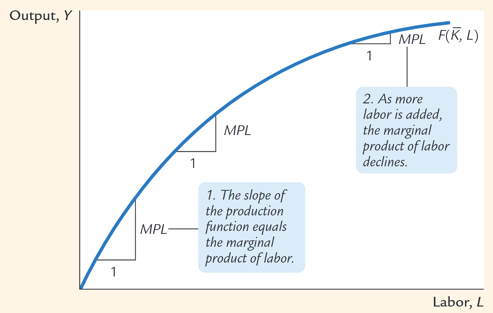
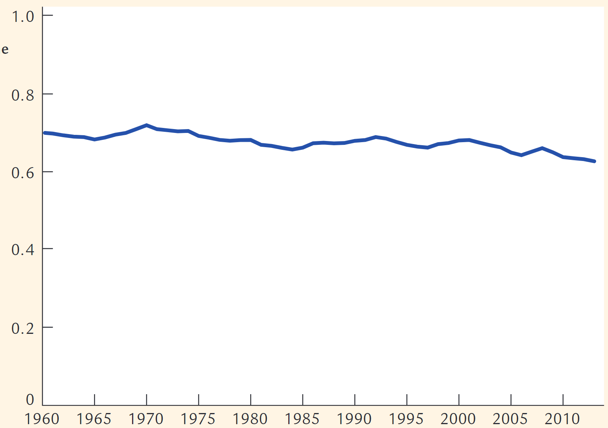

- Intro
  collapsed:: true
	- 建模
	  collapsed:: true
	   {:height 287, :width 548}
		- 基本思想：将经济学抽象为一个数学模型
		  collapsed:: true
			- 基础假设
				- 基本价格假设
				   {:height 55, :width 551}
					- market clearing：在长期市场，价格会快速变化（flexibility）使得供需平衡
					- sticky：在短期市场中，价格会保存粘性（即基本不变）
			- 自变量（外部变量）
			   {:height 34, :width 453}
			- 因变量（内部变量）
			   {:height 34, :width 562}
- 宏观经济中的关键数据
  collapsed:: true
	- Gross  domestic  product（GDP）
	  collapsed:: true
		- 存量和流量
		  collapsed:: true
		   {:height 276, :width 462}
			- 流量是当前时间的生产，被算进GDP
			- 存量作为社会的资产存量，存量的转移不被算成GDP。比如拍卖会、二手房、库存
		- GDP 衡量的整个社会的生产力
			- 我们可以通过总收入/总支出来衡量生产力
			- 在一笔交易中，收入和支出只取决于视角（买方支出，卖方收入，所以总收入和总支出本质上相同）
		- 库存对GDP的影响
			- 库存是作为生成者自己买下的
			- 第二年的库存销售作为资产的转移，即支出是库存，收入是买方，相互抵消
		- 实际GDP和名义GDP
			- 一般来说$GDP = Quantity * Price$
			- 名义GDP是用当前物价计算，包含了货币变动的影响
			- 实际GDP会固定某一年的物价计算GDP
			- 名义GDP和实际GDP的系数可以使用GDP Deflator
			  {:height 59, :width 235}
		- 上述计算的问题是没有考虑生产力的提高，比如电脑的价格持续下降
		  collapsed:: true
			- 为了解决这个问题，可以使用chain-weighted 计算
			- 即我们用相邻年份的平均价格，用它们来衡量实际GDP的real growth
				- 因为相邻年份的平均价格可能变化不大，所以可以用来衡量实际GDP的增长
		- GDP的计算
			- 支出法 C+I+G+NX
				- 消费C
				- 投资I
				- 政府投资G
				- 出口NX
		- 其它的指标
			- GNP：GDP + Factor Payments from Abroad - Factor Payments to Abroad
			-
	- consumer price index（CPI）
	  collapsed:: true
		- 衡量物价指数丈夫的指标，将一些商品的价格除以过去商品的价格
			- 由于不同商品的销量不一样，所以权重的价格不一样
		- producer price index：用生产者的价格指数衡量，即工厂消费的商品
		- CPI VS GDP Deflator VS PCE Deflator：都是通胀的衡量因子
			- CPI VS GDP Deflator
			  collapsed:: true
				- 1. GDP 包含所有的商品（比如包含政府消费和工厂消费）
				  2. CPI 只包含消费者消费的数据
				- 1. GDP只包含国内生成的
				  2. CPI也包含进口的
				- 从本质上来看，两者都是 市场上对一组价格的聚合 的比
				  1. GDP对每个商品的权重是不同的（即它的产量）
				  2. CPI一般使用固定权重
					- 例子：比如某年，橘子产量为0，库存的橘子价格暴涨。
					  CPI也会暴涨，因为它的橘子权重不变
					  GDP deflator不变，因为橘子产量为0，所以影响为0
					- 拉式指数（Laspeyres index）：a price index with a fixed basket of goods
					  collapsed:: true
						- 倾向于高估通胀，因为其没有考虑商品的替代（橘子和苹果的替代）
					- 帕氏指数（Paasche  index）：a  price  index  with  a  changing  basket
						- 倾向于低估通胀，因为其没有考虑替代的代价
			- PCE Deflator：使用GDP Deflator的计算方式，不过基于消费数据
				- 使用CPI的范围，比如只包括消费价格，还包括进口商品
				- 使用GDP的计算机方式，拥有可变的basket（即利用生产数据作为权重）
	- unemployment rate
	  collapsed:: true
		- 人是劳动市场中最重要的资源，我们可以将成年人分为以下三种：
			- employed：找到工作的
			- unemployed：想找但是未找到工作的
			- Not in the labor force：不想找工作的且无工作的，比如家庭主妇，学生等
		- 根据上述划分，可以得到两个指标
			- 劳动市场：employed + unemployed
			- 失业率
			   {:height 44, :width 381}
			- 劳动参与率
			  {:height 46, :width 399}
- Classical Theory：The Economy in the Long Run
  collapsed:: true
	- National Income: Where it comes from and where it goes
		- 关于线的循环流动
		   {:height 311, :width 446}
		- 生产的要素（Factor of production）
			- 资本$K$（Capital）
			- 劳动力$L$（Labor）
			- 产量通过生产方程描述
			  $$Y = F(K, L)$$
			- 当下我们假设资本价格和劳动价格不变，则得到
			  $$\overline Y = F(\overline K, \overline L)$$
			- 有一种特殊的性质，constant return to scale，即无限的扩展性
				- 无论资本或劳动力扩展多少倍，Y也扩展多少倍
				  $$zY = F(zK, zL)$$
		- The distribution of Income
			- Production
				- 价格由供需决定
				  collapsed:: true
					- 供需图可以抽象为
					  {:height 240, :width 411}
					- 由于我们假设需求不变，且价格不变，所以可以得到上述一条竖线，这就是本章讨论的假设
					-
				- 工厂决策：生产规模最大
				  collapsed:: true
					- 假设
						- Labor的工资（wage）是$W$，则工人的支出是Labor Costs = $WL$
						- 资本的租金（Rent）是$R$，则资本的总支出是Capital Costs = $RK$
						- 没件商品的价格是$P$，则整个生产的收益是$Revenue = PY$
					- 则利润为
					  $$Profit = PY - RK - WL$$
					- 我们希望PY最大，则需要考虑导数，即单位K 或 单位L带来的收益
					  collapsed:: true
						- MPL（Marginal Product of Labor）：每引入一个labor带来产品的提高
						  collapsed:: true
							- 定义: $MPL = F(K, L+1) - F(K, L)$
							- 由于资本等其它条件的约束，随着工人数量上升，MPL是边际递减的
							  {:height 274, :width 417}
							- 而最大的时候也就是单位工人带来收益正好为0的时候：
							  $$\Delta Profit = \Delta Revenue - \Delta Cost = P*MPL - W = 0$$
								- 此时$$MPL = \frac{W}{P}$$，这也被称为real wage，即单位是product的工资
								- 随着Labor的变多，实际工资变少
								  {:height 411, :width 569}
								-
								-
								-
							-
						- MPK（Marginal Capital of Labor）
						  collapsed:: true
							- 我们同样可得到规模最大的时候MPK
							  $$MPK*P - R = 0$$
							  $$MPK = R/P$$
							-
						- 同理我们可以定义经济上的利润，即以产品计数，下述公式*P就是上述Profit公式
						  collapsed:: true
						  Economic Profit = $$Y - (MPL*L) - (MPK*K)$$
							- 根据上述公式可得，销售收入Y被分成了三个部分
								- 资本支出
								- 工人支出
								- 利润
							- 当constant return to scale 被满足时，利润倾向为0，上述的优化是扩大规模，即有最大的产出
							- 此时利润为0，我们就可以得到Y的分配 $$Y = MPL*L + MPK*K$$
						- 值得注意的是，上述的推导是非常理想的
						  collapsed:: true
							- 所有的labor共享所有相同的K
							- 工厂作为资产本身的收入怎么算
						-
			- Production Function
				- Cobb-Douglas Production Function
					- Cobb-Douglas 根据统计信息观察到一个现象，随着经济的发展，资本收入和劳动收入的比例基本不变，由此推出Production function
					  collapsed:: true
						- 假设资本和劳动所占比例是$\alpha$
							- 资本收入$MPK*K = \alpha Y$
							- 劳动收入$$MPL*L = (1-\alpha) Y$$
						- 随着Y的增加，$$\alpha$$ 不变，由此得到方程
							- $$Y = A K^\alpha L^{1-\alpha}$$
						- 验证略
						- 通过上述公式我们可以算出
						  collapsed:: true
							- $MPK = \alpha Y / K$
							- $MPL = (1-\alpha)Y/K$
							- 即随着生产率上升，工资也会上升
							- 根据美国数据，可以观察得到类似的结论
							  
							-
					- 然后以更长的角度观察，劳动收入占比逐渐降低
					  {:height 310, :width 431}
					-